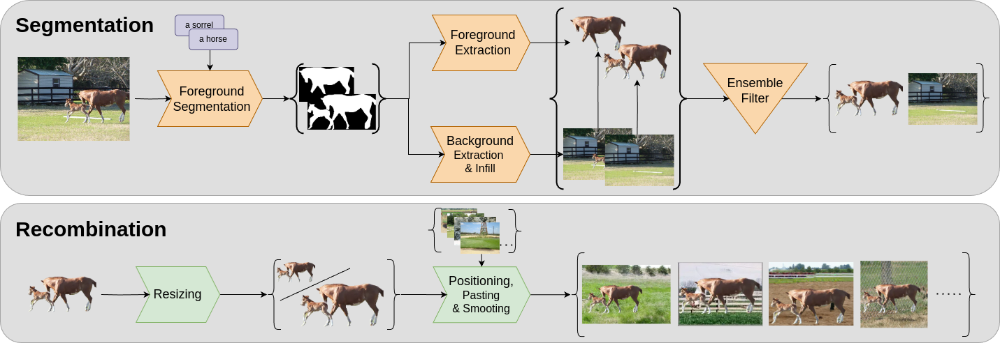

[](https://tobias.nauen-it.de/publication/foraug/)
[](https://arxiv.org/abs/2503.09399)
[](https://huggingface.co/datasets/TNauen/ForNet)

# ForAug



This is the public code repository for the paper [*ForAug*: Mitigating Biases and Improving Vision Transformer Training by Recombining Foregrounds and Backgrounds](https://www.arxiv.org/abs/2503.09399).

### Updates
- [13.11.2025] We have update the [ForAug arxiv preprint](https://arxiv.org/abs/2503.09399) with new experiments and models 🗞️
- [07.10.2025] We release the code for the [Segmentation Phase](#creating-fornet-from-scratch) 🖼️🔍
- [01.04.2025] We have created a [Project Page](https://tobias.nauen-it.de/publication/foraug/) for ForAug [🔗](https://tobias.nauen-it.de/publication/foraug/)
- [24.03.2025] We have [integrated ForNet into Huggingface Datasets](#with--huggingface-datasets) for easy and convenient use [beta] 🤗 💫
- [19.03.2025] We release the code to download and use ForNet in this repo 💻
- [19.03.2025] We release the patch files of [ForNet on Huggingface](https://huggingface.co/datasets/TNauen/ForNet) 🤗
- [12.03.2025] We release the preprint of [ForAug on arXiv](https://www.arxiv.org/abs/2503.09399) 🗒️

# Using ForAug/ForNet


## Local Installation

### Preliminaries

To be able to download ForNet, you will need the ImageNet dataset in the usual format at `<in_path>`:

```
<in_path>
|--- train
|    |--- n01440764
|    |    |--- n01440764_10026.JPEG
|    |    |--- n01440764_10027.JPEG
|    |    |--- n01440764_10029.JPEG
|    |    `-  ...
|    |--- n01693334
|    `-  ...
`-- val
     |--- n01440764
     |    |--- ILSVRC2012_val_00000293.JPEG
     |    |--- ILSVRC2012_val_00002138.JPEG
     |    |--- ILSVRC2012_val_00003014.JPEG
     |    `-  ...
     |--- n01693334
     `-  ...
```

### Downloading ForNet

To download and prepare the already-segmented ForNet dataset at `<data_path>`, follow these steps:

#### 1. Clone this repository and install the requirements

```
git clone https://github.com/tobna/ForAug
cd ForAug
pip install -r prep-requirements.txt
```

#### 2. Download the diff files

```
./download_diff_files.sh <data_path>
```

This script will download all dataset files to `<data_path>`

#### 3. Apply the diffs to ImageNet

```
python apply_patch.py -p <data_path> -in <in_path> -o <data_path>
```

This will apply the diffs to ImageNet and store the results in the `<data_path>` folder. It will also delete the already-processes patch files (the ones downloaded in step 2). In order to keep the patch files, add the `--keep` flag.

#### 4. Validate the ForNet files

To validate that you have all required files, run

```
python validate.py -f <data_path>
```

#### Optional: Zip the files without compression

When dealing with a large cluster and dataset files that have to be sent over the network (i.e. the dataset is on another server than the one used for processing) it's sometimes useful to not deal with many small files and have fewer large ones instead.
If you want this, you can zip up the files (without compression) by using

```
./zip_up.sh <data_path>
```

### Creating ForNet from Scratch

#### 1. Install the additional segmentation requirements
```
pip install -r requirements.txt segment-requirements.txt
```

#### 2. Segmentation and Infill
One can run the segmentation and infill pipeline by:
```
python segment_imagenet.py -d imagenet -df <PATH_TO_IMAGENET> -o <OUTPUT_FOLDER>
```
You may choose the infill model using the `--model` argument. It allows for [`LaMa`](https://arxiv.org/abs/2109.07161) or [`AttErase`](https://arxiv.org/abs/2412.12974).
There will be 4 folders created in `<OUTPUT_FOLDER>/train` and `<OUTPUT_FOLDER>/val`: `foregrounds`, `backgrounds`, `no_detect`, `error`.
Each one will have subfolders for each class with the relevant images inside.
When `--output-ims` is `all` (default), there may be multiple foreground-background versions for some images.
The best one will be selected in the [filtering step](#3-filtering-versions-of-the-same-image) below.

We suggest running the segmentation as a sbatch array job using a [slurm](https://slurm.schedmd.com/documentation.html) cluster.
For example scripts, see the `scripts/` folder.

ℹ️ The segmentation and infill stage can be resource intensive. On H100 GPUs, it runs at $374.3 \frac{\text{img}}{\text{GPU} \times \text{h}}$ for Attentive Eraser and $5338.6 \frac{\text{img}}{\text{GPU} \times \text{h}}$ for LaMa.

#### 3. Filtering versions of the same image
Filtering the output of the segmentation step is done by:
```
python filter_segmentation_versions.py -f <OUTPUT_FOLDER>
```
You can adjust the models used for filtering in line 83.

#### 4. Zip the files without compression
For the manual dataset creation this is mandatory, because the code for the size ratio calculation expects zip files.
See [the above section](#optional-zip-the-files-without-compression) on how to do the compression.

At this point, you should have a folder with 4 zip files: `backgrounds_train.zip`, `backgrounds_val.zip`, `foregrounds_train.zip`, `foregrounds_val.zip`. 

#### 5. Calculating the foreground size statistics
Run
```
python foreground_size_ratio.py -ds <OUTPUT_FOLDER>
```
with both modes `train` and `val` to create `fg_bg_ratios_train.json` and `fg_bg_ratios_val.json`.
At this point you are done and can [use ForNet](using-fornet-for-trainingevaluation).

### Using ForNet for training/evaluation

To use ForAug/ForNet you need to have it available in folder or zip form (see [Downloading ForNet](#downloading-fornet)) at `data_path`.
Additionally, you need to install the (standard) requirements from 'requirements.txt':

```
pip install -r requirements.txt
```

Then, just do

```python
from fornet import ForNet

data_path = ...

dataset = ForNet(
            data_path,
            train=True,
            transform=None,
            background_combination="all",
          )

```

For information on all possible parameters, run

```python
from fornet import ForNet

help(ForNet.__init__)
```

## With 🤗 Huggingface Datasets

We have integrated ForNet into [🤗 huggingface datasets](https://huggingface.co/docs/datasets/index), but we strongly recommend using the [local download](#downloading-fornet) and [ForNet dataset](#using-fornet-for-trainingevaluation) instead:

```Python
from datasets import load_dataset

ds = load_dataset(
    "TNauen/ForNet",
    trust_remote_code=True,
    split="train",
)
```

⚠️ You must be authenticated and have access to the `ILSVRC/imagenet-1k` dataset on the hub, since it is used to apply the patches and get the foreground and background information.

⚠️ Be prepared to wait while the files are downloaded and the patches are applied. This will only happen the first time you load the dataset. By default, well use as many CPU cores as available on the system. To limit the number of cores used set the `MAX_WORKERS` environment variable.

You can pass additional parameters to control the recombination phase:

- `background_combination`: Which backgrounds to combine with foregrounds. Options: `"orig", "same", "all"`.
- `fg_scale_jitter`: How much should the size of the foreground be changed (random ratio). Example: `(0.1, 0.8)`.
- `pruning_ratio`: For pruning backgrounds, with (foreground size/background size) $\geq$ <pruning_ratio>. Backgrounds from images that contain very large foreground objects are mostly computer generated and therefore relatively unnatural. Full dataset: `1.1`.
- `fg_size_mode`: How to determine the size of the foreground, based on the foreground sizes of the foreground and background images. Options: `"range", "min", "max", "mean"`.
- `fg_bates_n`: Bates parameter for the distribution of the object position in the foreground. Uniform Distribution: 1. The higher the value, the more likely the object is in the center. For fg_bates_n = 0, the object is always in the center.
- `mask_smoothing_sigma`: Sigma for the Gaussian blur of the mask edge.
- `rel_jut_out`: How much is the foreground allowed to stand/jut out of the background (and then cut off).
- `orig_img_prob`: Probability to use the original image, instead of the fg-bg recombinations. Options: `0.0`-`1.0`, `"linear", "revlinear", "cos"`.

For `orig_img_prob` schedules to work, you need to set `ds.epochs` to the total number of epochs you want to train.
Before each epoch set `ds.epoch` to the current epoch ($0 \leq$ `ds.epoch` $<$ `ds.epochs`).

To recreate our evaluation metrics, you may set:

- `fg_in_nonant`: Integer from 0 to 8. This will scale down the foreground and put it into the corresponding nonant (part of a 3x3 grid) in the image.
- `fg_size_fact`: The foreground object is (additionally) scaled by this factor.

# Citation
```BibTex
@misc{nauen2025foraug,
      title={ForAug: Mitigating Biases and Improving Vision Transformer Training by Recombining Foregrounds and Backgrounds},
      author={Tobias Christian Nauen and Brian Moser and Federico Raue and Stanislav Frolov and Andreas Dengel},
      year={2025},
      eprint={2503.09399},
      archivePrefix={arXiv},
      primaryClass={cs.CV},
}
```

## ToDos

- [x] release code to download and create ForNet
- [x] release code to use ForNet for training and evaluation
- [x] integrate ForNet into Huggingface Datasets
- [x] release code for the segmentation phase
